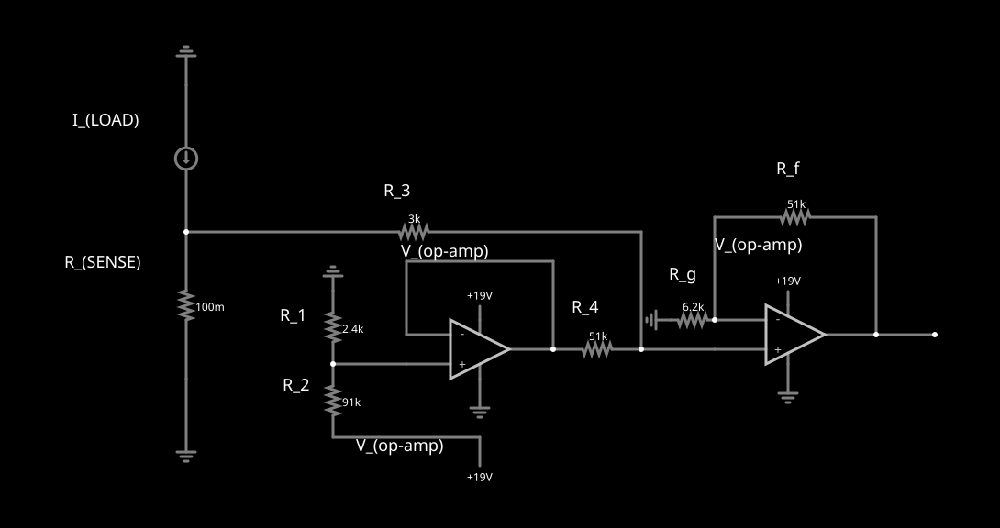

# MIE366 Current-Sense Resistor Optimizer

Supporting files for the **Candidate 2 buffered weighted-summing current-sense circuit** used in MIE366 Design Assignment 1.

## Circuit



Interactive Falstad model: [Open Candidate 2](https://www.falstad.com/s.php?s=RiAqLA)

## Design Target

The circuit is designed to approximate

$$
V_{\mathrm{OUT}} = 8.714\,V_{\mathrm{SENSE}} + 0.25
$$

Design constraints used by the optimizer:

- Sense resistor: **0.1 Ω**
- Load-current range: **0–3.5 A**
- Sense-voltage range: **0–0.35 V**
- Output-voltage target: **0.25–3.3 V**
- Ordinary resistors: **E24, 5% nominal values**
- Ordinary resistor range: **1 kΩ–100 kΩ**
- Op-amp supply: **+19 V / 0 V**

## Candidate 2 Topology

The optimized circuit uses three functional blocks:

1. a resistor divider to generate a positive reference voltage;
2. a voltage follower to buffer the reference;
3. a weighted-summing non-inverting stage to set the gain and offset.

The resistor naming used in the script is:

- `R1`: VREF node to ground
- `R2`: +19 V to VREF node
- `R3`: VSENSE to weighted-summing node
- `R4`: buffered VREF to weighted-summing node
- `Rg`: inverting input to ground
- `Rf`: VOUT to inverting input
- `Rsense`: current-sense resistor

## Optimization Method

`resistor_optimizer.py` searches permitted E24 resistor ratios and evaluates each retained design using two criteria:

- **Nominal maximum endpoint error** at 0 A and 3.5 A.
- **Worst-case tolerance error** using all $2^7 = 128$ upper/lower tolerance corners for the six ordinary resistors and `Rsense`.

No probability distribution is assumed for the tolerance analysis.

## Selected Nominal Configuration

| Component | Value |
|---|---:|
| `Rsense` | 0.1 Ω |
| `R1` | 2.4 kΩ |
| `R2` | 91 kΩ |
| `R3` | 3 kΩ |
| `R4` | 51 kΩ |
| `Rg` | 6.2 kΩ |
| `Rf` | 51 kΩ |

Nominal maximum endpoint error: **0.236 mV**.

## Running the Optimizer

Requirements:

```bash
pip install numpy
```

Run:

```bash
python3 resistor_optimizer.py --top 10 --output-dir results
```

Generated files:

- `results/theoretical_best.csv`
- `results/robust_best.csv`
- `results/analysis.json`

## Repository Layout

```text
.
├── README.md
├── circuit.svg
├── resistor_optimizer.py
└── results/
    ├── theoretical_best.csv
    ├── robust_best.csv
    └── analysis.json
```

The report contains the engineering justification; this repository provides the computational implementation and reproducibility files for Candidate 2.
